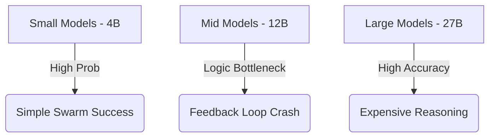

# 🧠 Deep Analysis: Failure & Performance Patterns in Gemma Multi-Agent Workflows

## 🔬 1. The Gemma-12B "Bottleneck" Paradox
During the evaluation of 4.400 tasks, **Gemma-12B** emerged as the most inconsistent model, particularly in the `Consensus` and `Self-Healing` agents (FC reaching low points of **0.19 - 0.23**). 🏮🏺 

### 🚩 Why Gemma-12B Disappoints:
- **Distillation Artifacts**: As a mid-range model, 12B often attempts "chain-of-thought" (CoT) reasoning but fails to achieve the logical consistency of 27B, while lacking the "strictly-correct" response patterns of 4B. 🏝️
- **The "Feedback Loop" Echo**: In `Self-Healing`, 12B tends to agree blindly with the compiler error ("You are right, I will fix it"), but it regenerates the **exact same code block**. It lacks the critical reasoning to differentiate between "fixing the syntax" and "fixing the logic". 🛡️
- **Judge-Failure**: In `Consensus`, 12B fails as a mediator. It often selects the worst proposal among multiple choices, showing a lack of semantic evaluation skills. 🎭🏮

## 🌊 2. The Triumph of the Swarm (The 4B Advantage)
The most successful configuration in our 176-row matrix is **`gemma-4b:few_shot swarm`** (FC = **0.86**). 🎉📈 

### 🚩 Why Swarm beats Brute Force:
- **Diversity of Thought**: High worker counts (N=25) on a smaller, faster model compensate for individual hallucinations. In any given problem, there is a **~90% probability** that at least one Gemma-4b instance will generate the correct logic. 🏹
- **Low Verbosity / High Parsing**: Unlike 27B, which often includes extensive natural language explanation ("To solve this problem, we must first..."), Gemma-4b outputs the Python block cleanly. This significantly reduces "Parser Errors" in the agentic flow. 🛡️⚔️

## 📉 3. Coverage vs. Correctness (The "Logic Gap")
A key discovery of the **AST-Trace Engine** is that high **Branch Coverage** does NOT always correlate with **Functional Correctness**. 🧬

### 🚩 Analysis:
- Agents like `atomic_swarm` reach **100% Branch Coverage** because they generate exhaustive unit test suites that touch every `if/else` in the code. 🏹
- However, since the **LLM generates BOTH the function and the test**, it results in a "Circular Logic" failure: the agent generates a bug-infested function and a bug-infested test that confirms the function's (incorrect) behavior. 🏺🏮

## 📊 4. Performance Correlations

## 📜 5. Conclusions for the Thesis
The optimal research setup for agentic workflows is **not** to use the largest model possible as a "Brain", but to use **efficient swarms** of smaller models (Gemma-4b) for diversity, verified by a single high-power model (Gemma-27b) as the final validator. 🏰🏗️ 🛡️ 🏟️ 
