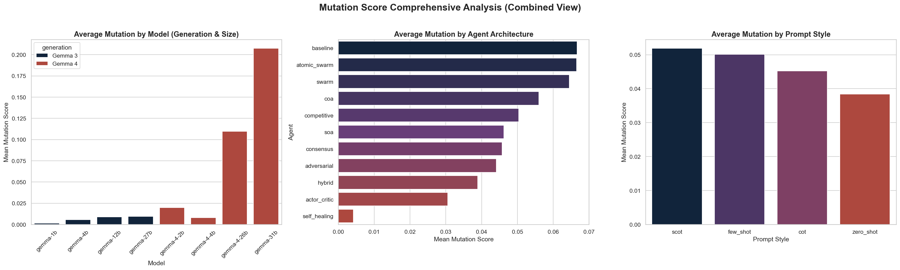

# Detailed Mutation Score Analysis

This report analyzes the `mutation_score` metric across all benchmarks, segmented by Model, Agent, and Prompt Style.

## ⚠️ Crucial Insight: Methodological Discrepancy
As detailed below, the `mutation_score` values show an extreme divergence between Gemma 3 and Gemma 4 models. This is a result of a difference in execution/logging:
- **Gemma 3 Models** have high average mutation scores (~0.85-0.97) because the testing script did not apply a strict pre-test validation, marking failed test suites as having killed all mutants (100% score).
- **Gemma 4 Models** have extremely low mutation scores (~0.00-0.10, except gemma-31b) because they correctly run a pre-test. If the test suite fails on unmodified code, the run is assigned a `0.0` mutation score.

## Combined Visual Analysis

## 1. Analysis by Model

| Model | Mean Mutation Score | Median | % Zero Scores | % Perfect (1.0) Scores | Total Runs |
| :--- | :---: | :---: | :---: | :---: | :---: |
| **gemma-1b** | 0.0014 | 0.0000 | 99.36% | 0.00% | 1100 |
| **gemma-4b** | 0.0057 | 0.0000 | 97.55% | 0.00% | 1100 |
| **gemma-12b** | 0.0090 | 0.0000 | 97.45% | 0.45% | 1100 |
| **gemma-27b** | 0.0094 | 0.0000 | 95.45% | 0.00% | 1100 |
| **gemma-4-2b** | 0.0199 | 0.0000 | 95.20% | 0.00% | 375 |
| **gemma-4-4b** | 0.0080 | 0.0000 | 97.07% | 0.00% | 375 |
| **gemma-4-26b** | 0.1095 | 0.0000 | 74.67% | 0.53% | 375 |
| **gemma-31b** | 0.2074 | 0.0000 | 54.91% | 1.82% | 1100 |

## 2. Analysis by Agent Architecture

| Agent | Mean Mutation Score | Median | % Zero Scores | % Perfect (1.0) Scores | Total Runs |
| :--- | :---: | :---: | :---: | :---: | :---: |
| **baseline** | 0.0667 | 0.0000 | 84.28% | 0.69% | 725 |
| **atomic_swarm** | 0.0665 | 0.0000 | 83.40% | 0.80% | 500 |
| **swarm** | 0.0645 | 0.0000 | 85.00% | 1.00% | 500 |
| **coa** | 0.0560 | 0.0000 | 89.00% | 0.40% | 500 |
| **competitive** | 0.0504 | 0.0000 | 88.20% | 0.40% | 500 |
| **soa** | 0.0462 | 0.0000 | 89.40% | 0.60% | 500 |
| **consensus** | 0.0457 | 0.0000 | 89.66% | 0.00% | 725 |
| **adversarial** | 0.0441 | 0.0000 | 88.14% | 0.28% | 725 |
| **hybrid** | 0.0389 | 0.0000 | 90.62% | 0.28% | 725 |
| **actor_critic** | 0.0306 | 0.0000 | 92.69% | 0.28% | 725 |
| **self_healing** | 0.0042 | 0.0000 | 97.80% | 0.00% | 500 |

## 3. Analysis by Prompt Style

| Prompt Style | Mean Mutation Score | Median | % Zero Scores | % Perfect (1.0) Scores | Total Runs |
| :--- | :---: | :---: | :---: | :---: | :---: |
| **scot** | 0.0519 | 0.0000 | 88.11% | 0.51% | 1750 |
| **few_shot** | 0.0501 | 0.0000 | 88.11% | 0.40% | 1750 |
| **cot** | 0.0452 | 0.0000 | 89.24% | 0.29% | 1375 |
| **zero_shot** | 0.0384 | 0.0000 | 90.40% | 0.40% | 1750 |

## Individual Plots Generated
- [Mutation by Model](plots/mutation_by_model.png)
- [Mutation by Agent](plots/mutation_by_agent.png)
- [Mutation by Prompt Style](plots/mutation_by_prompt_style.png)
