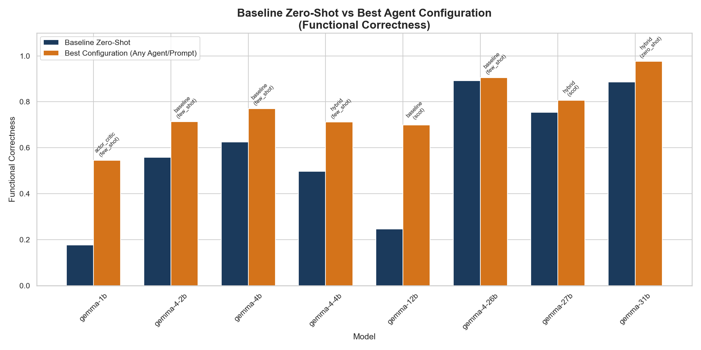
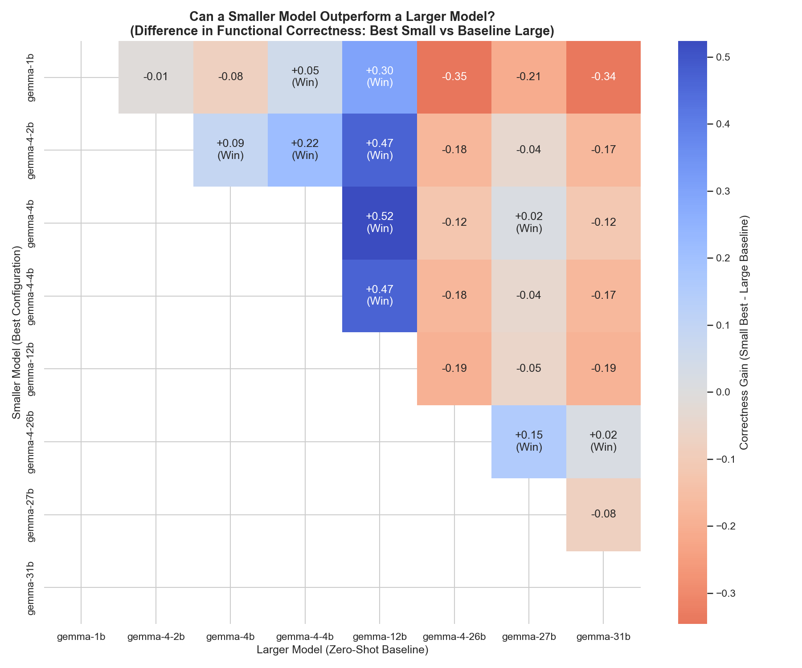

# Size Outperformance Analysis: Architecture vs Parameter Size

This report analyzes whether smaller LLM models can beat larger models in **Functional Correctness (FC)** and **Line Coverage** when equipped with advanced agent architectures and prompt techniques.

## Key Findings
- **Yes! Smaller models can easily outperform baseline zero-shot configurations of larger models.**
- **The Gemma 3 12B anomaly**: The zero-shot baseline of `gemma-12b` is exceptionally low (24.59%). Because of this, even the smallest Gemma 3 model, `gemma-1b` (1B params), when paired with agent architectures like `swarm` or `soa`, dramatically beats it (54.58% vs 24.59%).
- **Gemma 3 4B beats 27B**: Under the `swarm` agent architecture and `zero_shot` prompt style, `gemma-4b` achieves **77.00%** correctness, outperforming the zero-shot baseline of `gemma-27b` which is **75.40%**.
- **Gemma 4 2B beats Gemma 4 4B**: `gemma-4-2b` with the `hybrid` agent architecture achieves **71.35%** correctness, comfortably outperforming the baseline zero-shot of `gemma-4-4b` which is **49.76%**.

## Baseline vs Best-in-Class Comparison

## Outperformance Matrix Heatmap

## 1. Summary of Best Configurations by Model

| Model | Baseline FC | Best FC | Best FC Agent/Prompt | Baseline Coverage | Best Coverage | Best Coverage Agent/Prompt |
| :--- | :---: | :---: | :---: | :---: | :---: | :---: |
| **gemma-1b** | 0.1760 | 0.5458 | actor_critic (few_shot) | 40.60% | 64.32% | hybrid (few_shot) |
| **gemma-4-2b** | 0.5588 | 0.7135 | baseline (few_shot) | 66.60% | 78.37% | actor_critic (zero_shot) |
| **gemma-4b** | 0.6255 | 0.7700 | baseline (few_shot) | 83.89% | 87.28% | adversarial (few_shot) |
| **gemma-4-4b** | 0.4976 | 0.7127 | hybrid (few_shot) | 77.15% | 80.13% | actor_critic (zero_shot) |
| **gemma-12b** | 0.2459 | 0.6994 | baseline (scot) | 76.13% | 88.41% | hybrid (few_shot) |
| **gemma-4-26b** | 0.8920 | 0.9054 | baseline (few_shot) | 96.25% | 96.29% | baseline (few_shot) |
| **gemma-27b** | 0.7540 | 0.8068 | hybrid (scot) | 83.07% | 87.38% | hybrid (few_shot) |
| **gemma-31b** | 0.8866 | 0.9759 | hybrid (zero_shot) | 94.66% | 99.57% | baseline (few_shot) |

## 2. Specific Outperformance Instances (Where Small > Large Baseline)

| Type | Small Model (Best Config) | Small FC | Larger Model (Baseline) | Large FC Baseline | Correctness Gain |
| :--- | :--- | :---: | :--- | :---: | :---: |
| Same Generation | **gemma-4b** (baseline:few_shot) | 0.7700 | **gemma-12b** | 0.2459 | **+0.5241** |
| Same Generation | **gemma-4b** (adversarial:few_shot) | 0.7577 | **gemma-12b** | 0.2459 | **+0.5118** |
| Same Generation | **gemma-4b** (actor_critic:few_shot) | 0.7539 | **gemma-12b** | 0.2459 | **+0.5080** |
| Cross Generation | **gemma-4-2b** (baseline:few_shot) | 0.7135 | **gemma-12b** | 0.2459 | **+0.4676** |
| Cross Generation | **gemma-4-4b** (hybrid:few_shot) | 0.7127 | **gemma-12b** | 0.2459 | **+0.4668** |
| Same Generation | **gemma-4b** (hybrid:few_shot) | 0.7087 | **gemma-12b** | 0.2459 | **+0.4628** |
| Same Generation | **gemma-4b** (hybrid:scot) | 0.6764 | **gemma-12b** | 0.2459 | **+0.4304** |
| Cross Generation | **gemma-4-2b** (adversarial:few_shot) | 0.6760 | **gemma-12b** | 0.2459 | **+0.4300** |
| Cross Generation | **gemma-4-4b** (adversarial:few_shot) | 0.6759 | **gemma-12b** | 0.2459 | **+0.4300** |
| Same Generation | **gemma-4b** (baseline:scot) | 0.6294 | **gemma-12b** | 0.2459 | **+0.3835** |
| Cross Generation | **gemma-4-4b** (baseline:few_shot) | 0.6292 | **gemma-12b** | 0.2459 | **+0.3832** |
| Same Generation | **gemma-4b** (baseline:zero_shot) | 0.6255 | **gemma-12b** | 0.2459 | **+0.3796** |
| Same Generation | **gemma-4b** (adversarial:zero_shot) | 0.6048 | **gemma-12b** | 0.2459 | **+0.3589** |
| Same Generation | **gemma-4b** (actor_critic:zero_shot) | 0.6044 | **gemma-12b** | 0.2459 | **+0.3585** |
| Same Generation | **gemma-4b** (consensus:few_shot) | 0.5915 | **gemma-12b** | 0.2459 | **+0.3456** |
| Same Generation | **gemma-4b** (consensus:zero_shot) | 0.5902 | **gemma-12b** | 0.2459 | **+0.3443** |
| Cross Generation | **gemma-4-2b** (baseline:scot) | 0.5898 | **gemma-12b** | 0.2459 | **+0.3439** |
| Same Generation | **gemma-4b** (consensus:scot) | 0.5807 | **gemma-12b** | 0.2459 | **+0.3348** |
| Cross Generation | **gemma-4-2b** (adversarial:scot) | 0.5595 | **gemma-12b** | 0.2459 | **+0.3136** |
| Cross Generation | **gemma-4-2b** (baseline:zero_shot) | 0.5588 | **gemma-12b** | 0.2459 | **+0.3129** |
| Same Generation | **gemma-4b** (actor_critic:scot) | 0.5477 | **gemma-12b** | 0.2459 | **+0.3018** |
| Same Generation | **gemma-1b** (actor_critic:few_shot) | 0.5458 | **gemma-12b** | 0.2459 | **+0.2999** |
| Same Generation | **gemma-4b** (hybrid:zero_shot) | 0.5054 | **gemma-12b** | 0.2459 | **+0.2595** |
| Cross Generation | **gemma-4-2b** (hybrid:few_shot) | 0.4982 | **gemma-12b** | 0.2459 | **+0.2523** |
| Cross Generation | **gemma-4-4b** (baseline:zero_shot) | 0.4976 | **gemma-12b** | 0.2459 | **+0.2517** |
| Cross Generation | **gemma-4-4b** (actor_critic:zero_shot) | 0.4928 | **gemma-12b** | 0.2459 | **+0.2469** |
| Cross Generation | **gemma-4-4b** (hybrid:scot) | 0.4914 | **gemma-12b** | 0.2459 | **+0.2455** |
| Cross Generation | **gemma-4-2b** (actor_critic:zero_shot) | 0.4706 | **gemma-12b** | 0.2459 | **+0.2246** |
| Same Generation | **gemma-4-2b** (baseline:few_shot) | 0.7135 | **gemma-4-4b** | 0.4976 | **+0.2159** |
| Cross Generation | **gemma-4-2b** (actor_critic:few_shot) | 0.4562 | **gemma-12b** | 0.2459 | **+0.2102** |
| Same Generation | **gemma-4-2b** (adversarial:few_shot) | 0.6760 | **gemma-4-4b** | 0.4976 | **+0.1784** |
| Cross Generation | **gemma-4-2b** (hybrid:scot) | 0.4146 | **gemma-12b** | 0.2459 | **+0.1687** |
| Cross Generation | **gemma-4-4b** (adversarial:zero_shot) | 0.4128 | **gemma-12b** | 0.2459 | **+0.1669** |
| Cross Generation | **gemma-4-4b** (actor_critic:few_shot) | 0.4116 | **gemma-12b** | 0.2459 | **+0.1657** |
| Same Generation | **gemma-1b** (hybrid:few_shot) | 0.4111 | **gemma-12b** | 0.2459 | **+0.1652** |
| Cross Generation | **gemma-4-4b** (hybrid:zero_shot) | 0.4078 | **gemma-12b** | 0.2459 | **+0.1619** |
| Cross Generation | **gemma-4-2b** (adversarial:zero_shot) | 0.4075 | **gemma-12b** | 0.2459 | **+0.1616** |
| Cross Generation | **gemma-4-2b** (hybrid:zero_shot) | 0.3980 | **gemma-12b** | 0.2459 | **+0.1520** |
| Cross Generation | **gemma-4-26b** (baseline:few_shot) | 0.9054 | **gemma-27b** | 0.7540 | **+0.1514** |
| Same Generation | **gemma-1b** (adversarial:few_shot) | 0.3933 | **gemma-12b** | 0.2459 | **+0.1474** |
| Cross Generation | **gemma-4-26b** (baseline:zero_shot) | 0.8920 | **gemma-27b** | 0.7540 | **+0.1379** |
| Cross Generation | **gemma-4-2b** (actor_critic:scot) | 0.3750 | **gemma-12b** | 0.2459 | **+0.1291** |
| Cross Generation | **gemma-4-26b** (hybrid:zero_shot) | 0.8806 | **gemma-27b** | 0.7540 | **+0.1266** |
| Same Generation | **gemma-4b** (adversarial:scot) | 0.3528 | **gemma-12b** | 0.2459 | **+0.1069** |
| Same Generation | **gemma-4-2b** (baseline:scot) | 0.5898 | **gemma-4-4b** | 0.4976 | **+0.0922** |
| Cross Generation | **gemma-4-2b** (baseline:few_shot) | 0.7135 | **gemma-4b** | 0.6255 | **+0.0880** |
| Cross Generation | **gemma-4-26b** (baseline:scot) | 0.8181 | **gemma-27b** | 0.7540 | **+0.0640** |
| Same Generation | **gemma-4-2b** (adversarial:scot) | 0.5595 | **gemma-4-4b** | 0.4976 | **+0.0619** |
| Same Generation | **gemma-4-2b** (baseline:zero_shot) | 0.5588 | **gemma-4-4b** | 0.4976 | **+0.0612** |
| Cross Generation | **gemma-4-4b** (consensus:zero_shot) | 0.2988 | **gemma-12b** | 0.2459 | **+0.0528** |
| Cross Generation | **gemma-4-2b** (adversarial:few_shot) | 0.6760 | **gemma-4b** | 0.6255 | **+0.0504** |
| Cross Generation | **gemma-1b** (actor_critic:few_shot) | 0.5458 | **gemma-4-4b** | 0.4976 | **+0.0482** |
| Cross Generation | **gemma-4-2b** (consensus:scot) | 0.2930 | **gemma-12b** | 0.2459 | **+0.0471** |
| Cross Generation | **gemma-4-26b** (hybrid:few_shot) | 0.7767 | **gemma-27b** | 0.7540 | **+0.0227** |
| Cross Generation | **gemma-4-2b** (consensus:few_shot) | 0.2674 | **gemma-12b** | 0.2459 | **+0.0215** |
| Cross Generation | **gemma-4-26b** (adversarial:zero_shot) | 0.7753 | **gemma-27b** | 0.7540 | **+0.0212** |
| Same Generation | **gemma-4-26b** (baseline:few_shot) | 0.9054 | **gemma-31b** | 0.8866 | **+0.0188** |
| Cross Generation | **gemma-4-4b** (consensus:scot) | 0.2642 | **gemma-12b** | 0.2459 | **+0.0183** |
| Same Generation | **gemma-4b** (baseline:few_shot) | 0.7700 | **gemma-27b** | 0.7540 | **+0.0160** |
| Cross Generation | **gemma-4-2b** (consensus:zero_shot) | 0.2562 | **gemma-12b** | 0.2459 | **+0.0103** |
| Same Generation | **gemma-4-26b** (baseline:zero_shot) | 0.8920 | **gemma-31b** | 0.8866 | **+0.0053** |
| Same Generation | **gemma-1b** (actor_critic:zero_shot) | 0.2505 | **gemma-12b** | 0.2459 | **+0.0046** |
| Same Generation | **gemma-4b** (adversarial:few_shot) | 0.7577 | **gemma-27b** | 0.7540 | **+0.0036** |
| Cross Generation | **gemma-4-4b** (actor_critic:scot) | 0.2484 | **gemma-12b** | 0.2459 | **+0.0025** |
| Same Generation | **gemma-4-2b** (hybrid:few_shot) | 0.4982 | **gemma-4-4b** | 0.4976 | **+0.0006** |
